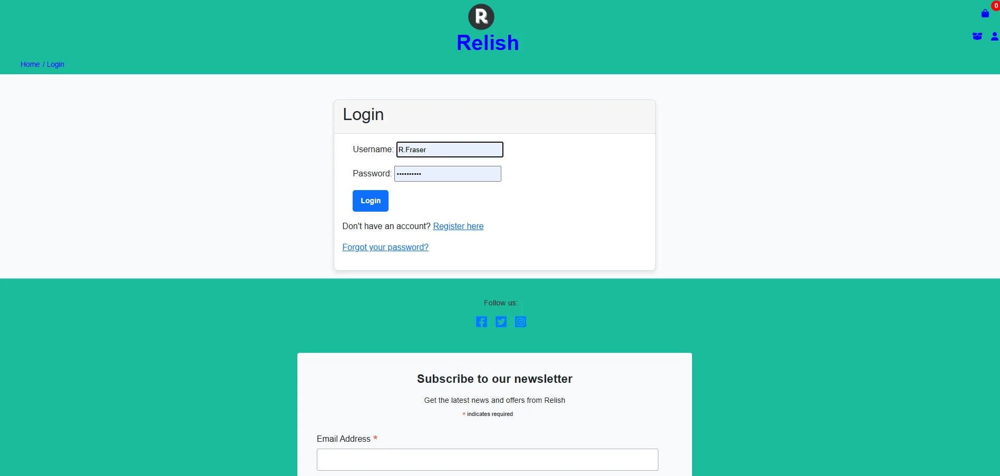
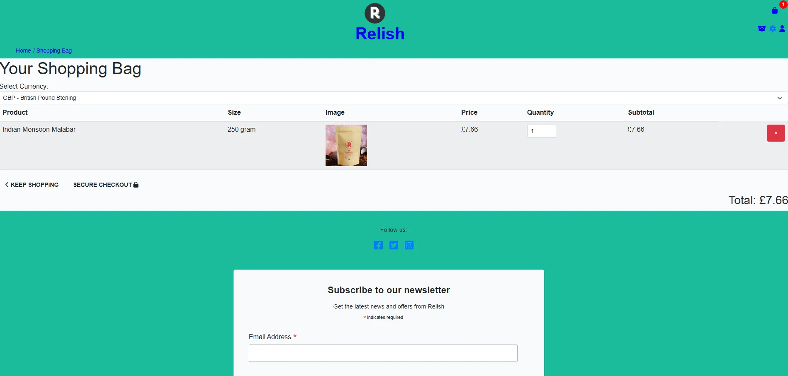
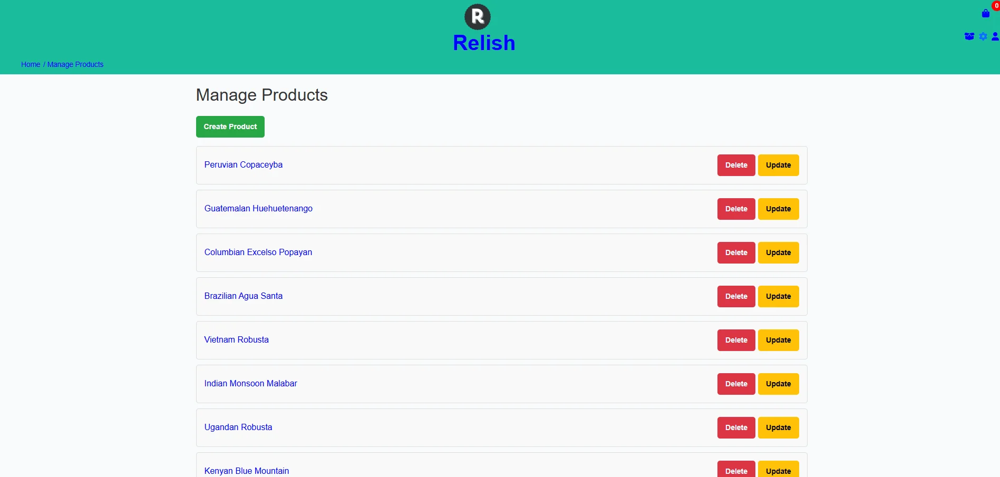

figure 1 - Home screen

**Note:** This project builds upon the foundational work from Project 4, enhancing it with additional features and improvements.

## Intent Behind the Creation of Relish

The **Relish** site was created to provide an online shopping experience for coffee enthusiasts. The platform offers a wide selection of premium coffee products sourced from various continents, ensuring diversity and quality. Relish aims to make the process of discovering, purchasing, and enjoying coffee effortless, with a focus on user satisfaction and an aesthetically pleasing, responsive design.

## Data Features

1. **Product Management**:
   - Detailed product information including name, price, description, currency, and images.
   - Categorization based on continents (African, Asian, American) with corresponding visuals.
   - CRUD functionality for product management by authorized administrators.

2. **User Profiles**:
   - Secure registration and login system.
   - Personalized user dashboards to update profile details and view order history.

3. **Shopping Bag and Checkout**:
   - Dynamic bag management with add, update, and remove functionality.
   - Checkout process using session-based `bag_items` for real-time updates.

4. **Order Management**:
   - Integration of `OrderForm` to collect and validate customer data.
   - Clear and concise feedback messages during checkout and order completion.

---

## Security Features

1. **Authentication & Authorization**:
   - User authentication system with secure password storage.
   - Permissions for administrative actions like product deletion.

2. **Data Protection**:
   - Use of environment variables (`env.py`) to store sensitive keys (e.g., secret key, Stripe public key).
   - Exclusion of ZIP code in payment data for simplicity and security.

3. **Payment Security**:
   - Integration with Stripe for processing payments securely.
   - Protection of cardholder information during transactions.

4. **Error Handling**:
   - Comprehensive validation for form inputs and database fields to prevent invalid data.
   - Use of messages to guide users through potential errors and successful actions.

5. **External Integrations**:
   - Acknowledgement of secure third-party services like Facebook (for engagement), Mailchimp (for marketing) and Stripe (for payments).

## SEO Configuration

### robots.txt

The `robots.txt` file is located at the root of the project and is used to control how search engine crawlers index the site. It can specify which pages should or should not be crawled by search engines.

- **Location:** `/robots.txt`
- **Purpose:** Directs web crawlers on which pages to index or avoid.

### sitemap.xml

The `sitemap.xml` file is also located at the root of the project. It provides search engines with a map of your website’s pages, making it easier for them to crawl and index the site efficiently.

- **Location:** `/sitemap.xml`
- **Purpose:** Provides a list of all important pages on the site for search engines.

### Stripe

Stripe is used for handling secure payments in the Relish shop. It allows customers to complete their purchases using card payment methods while ensuring that all transactions are processed safely and efficiently.

### Facebook
Screenshots of the Relish Facebook page have been used to provide users with a visual representation of our social media presence.

figure 2 - Facebook Page_1

figure 3 - Facebook Page_2

### Mailchimp
Mailchimp integration enables the collection and management of customer email subscriptions. It allows us to send newsletters, promotional offers, and updates directly to our users, helping to maintain engagement with our audience.

With these features, Relish ensures a secure, efficient, and delightful experience for all users while safeguarding their data and fostering trust.

## Key Objectives

The key objectives for the Relish coffee shop website project are as follows:

Enhance User Experience:

Provide an intuitive and visually appealing interface for customers to browse and make purchases.
Ensure the website is responsive and accessible on various devices and screen sizes.

Efficient Data Management:

Implement a robust database structure using Entity-Relationship Diagrams (ERDs) to ensure data integrity and efficiency.
Facilitate easy addition, modification, and deletion of menu items by the admin through a user-friendly admin interface.
Security and Reliability:

Ensure secure handling of user data, including encrypted storage of passwords.
Perform thorough testing, including unit tests, to ensure the reliability and correctness of the codebase.

Maintainability and Scalability:

Write clean, maintainable, and well-documented code adhering to coding standards such as PEP8 for Python.
Design the system to be scalable to handle an increasing number of users and orders as the business grows.
Compliance with Web Standards:

Validate HTML, CSS, and JavaScript code to ensure compliance with web standards and improve cross-browser compatibility.
Ensure the website is accessible to users with disabilities, following accessibility guidelines.

## Design Process

### 1. Requirements Gathering

The initial step involved identifying user needs and functionality requirements for the relish application. This included:

User registration and authentication
Product management (CRUD operations)
Category and coffee origin selection
Image upload and display
Price and currency handling

### 2. Entity Relationship Diagram (ERD)

To visualize the data structure and relationships between various entities in the application, an Entity Relationship Diagram was created. The primary entities include:

Product: Represents coffee products, including details like name, description, price, currency, and associated images.
Category: Represents different categories of products.
CoffeeOrigin: Represents the origin of the coffee beans.
CoffeeGrind: Represents the grind types available for products.
CoffeeSize: Represents different sizes available for products.

figure 4 - Entity-Relationship Diagrams (ERD)

### 3. Wireframes
Wireframes were designed to outline the user interface and user experience. They serve as blueprints for the layout and functionality of key pages within the application.

figure 5 - Wireframe (ERD)

## User Stories

User stories were essential in guiding the development process, ensuring that the website meets the needs of its users.

figure 6 - User Stories

### Screenshots

figure 7 - Main screen

figure 8 - Register form

figure 9 - Login screen

figure 10 - Profile screen

figure 11 - Product detail page

figure 12 - Shopping bag

figure 13 - Checkout success

figure 14 - CRUD menu

### 2. Responsive Design

#### Overview

Responsive design is a crucial aspect of the relish application, ensuring that users have a seamless experience across various devices, including desktops, tablets, and smartphones. The design adapts fluidly to different screen sizes and orientations, enhancing usability and accessibility.

Key Principles

- Fluid Grids: The layout is constructed using a fluid grid system, allowing elements to resize proportionally based on the screen width. This approach ensures that content is well-distributed and easy to navigate on all devices.

- Flexible Images: Images within the application are designed to be responsive, utilizing CSS properties such as max-width: 100%; and height: auto;. This ensures that images resize appropriately without losing their aspect ratio, providing a visually appealing experience.

- Media Queries: CSS media queries are employed to apply different styles based on device characteristics, such as width and resolution. This allows for adjustments in layout, font sizes, and element visibility for optimal presentation on various devices.

### 4. Stylish UI/UX

Design an aesthetically pleasing user interface with appropriate styling using CSS. Utilize visual elements to enhance the experience and make the interface more engaging.

### 5. Code Organization

Maintain a well-organized codebase with clear separation of concerns. Use separate HTML, CSS, and JavaScript files to enhance readability and ease of maintenance. Comment the code where necessary to provide insights into the implementation details.

# Testing

## Unit Tests

Unit tests were written to ensure the reliability and correctness of the code. Each function and component of the website was tested individually to verify that they work as expected. The tests cover various aspects such as:

Form validation
User authentication
Enquiry processing
Menu item management
Code Validation

The test results can be seen in the TESTING.md file.

All Python code was validated against the PEP8 style guide to maintain readability and consistency. PEP8 compliance helps in keeping the codebase clean and manageable.

## HTML Validator

The HTML code was validated using the W3C HTML Validator to ensure it meets web standards but has one error.

- The Ethiopian paragraph is doubled up on open and close tags 
 
, but when I check the admin panel and click on code view they are not doubled up.

#### Testing Screenshots

figure 15 - Home screen lighthouse test

figure 16 - product detail lighthouse test

## Bugs

There is one bug in the system which is the confirmation emails are not being sent, but they work in the shell.

# Deployment

## Prerequisites

heroku, gunicorn, and psycopg2

## Deployment steps

Install the required dependencies: pip install -r requirements.txt

Configured environment variables.

Ran migrations.

Collected static files.

deploy to heroku

## Usage

To start the development server, run:

python manage.py runserver

Open your web browser and go to http://127.0.0.1:8000/ to see the website in action.

## Contributing

We welcome contributions to improve Relish! Please fork the repository and submit pull requests for any enhancements or bug fixes.

## License

This project is licensed under the MIT License. See the LICENSE file for more details.

## Credit

Code Institute for template and stripe

Code Institute for the deployment terminal.

PEP8 Validator for code validation.

3wSchools.com for breadcrumbs and permissions
